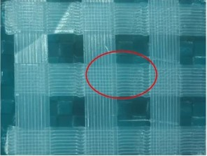

  <nav>
  <ul>
	<li><a href="">Home</a></li>	
    <li><a href="#teaching">Teaching</a></li> 
    <li><a href="#" class="current">Research</a></li>
  </ul>
  </nav>

### Research

<table style="border: 0px none">
<tbody style="border: 0px none">
<tr style="border: 0px none">
<td width="180" style="border: 0px none"></td>
<td style="border: 0px none">
  
<h2 style="border-bottom: 0px none;">Weaving path planning for FDM</h2>
     In order to strengthen the connection between layers in FFF process, this project presents a 3D weaving tool path that can be constructed by a 5-layer cyclic structure to achieve inter-layer interlocking or embedding to improve mechanical properties between layers. The developed algorithm extends the weaving path as a common infill pattern to fill different structures. This process can be realized with a common three-axis 3D printer. Compared with 3D printed parts with layer to layer deposit, the interlayer anisotropy are significantly reduced  to 10.21% and 0.98%. We further extend the planning method to adapt different geometric models. 
    <a href="">Project page</a> 
  

</td>
<td style="border: 0px none"></td>
</tr>
</tbody></table>

<table style="border: 0px none">
<tbody style="border: 0px none">
<tr style="border: 0px none">
<td width="180" style="border: 0px none"></td>
<td style="border: 0px none">
  
<h2 style="border-bottom: 0px none;">Continuous fiber-reinforced 3D Printing</h2>
      This project presents a method for printing fiber-reinforced composite on the common fused filament fabrication (FFF) platform. Polylactic Acid (PLA) and Polyethylene terephthalate (PET) fibers are used as printing materials. And a spatial continuous toolpath planning strategy is designedto reduce the workload of post-processing. Experimental results show that this process not only enables the printing of models with complex geometric shapes but also supports material recycling and reuse. Mechanical tests show that the maximum tensile strength of continuous PET fiber-reinforced thermoplastic composites (PFRTPCs) is increased by 117.8% compared to PA66. 
    <a href="#">Project page</a> 
  

</td>
<td style="border: 0px none"></td>
</tr>
</tbody></table>

<table style="border: 0px none">
<tbody style="border: 0px none">
<tr style="border: 0px none">
<td width="180" style="border: 0px none"></td>
<td style="border: 0px none">
  
<h2 style="border-bottom: 0px none;">3D printing by multiple axies robot arm</h2>
     This project aims transporting 3D printing softwares from 3-axis device to multi-axis robot arm platforms. The hardware system and software system are designed to synchronize the movement of TCP and the material feeding. Both continuous fiber-reinforced composite and the pure composite are supported as the printing material, and it can print on different spatial planes and curve planes. Compared with traditional 3D printing, this manufacturing method is flexible enough to fill material along a spatial path that can reduce the impact of the anisotropy of the mechanical properties of the fiber-reinforced material on the 3D printed structure..  
    <a href="#">Project page</a> 
  

</td>
<td style="border: 0px none"></td>
</tr>
</tbody></table>

<table style="border: 0px none">
<tbody style="border: 0px none">
<tr style="border: 0px none">
<td width="180" style="border: 0px none"></td>
<td style="border: 0px none">
  
<h2 style="border-bottom: 0px none;">Rule-driven toplogy optimization</h2>
    The goal of our research is to provide a rule based method to simplify the topology optimization process. We use defeasible logic to decribe the designer's incomplete knowledge as rules. A rule-driven structure evolution framworks is designed to generate satisfied structure. By using this design pattern, the design knowledge can be saved, translated, and accumulated. 
    <a href="https://github.com/fly2mars/suMasTo">Project page</a> 
  

</td>
<td style="border: 0px none"></td>
</tr>
</tbody></table>

